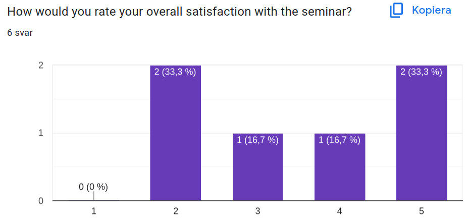
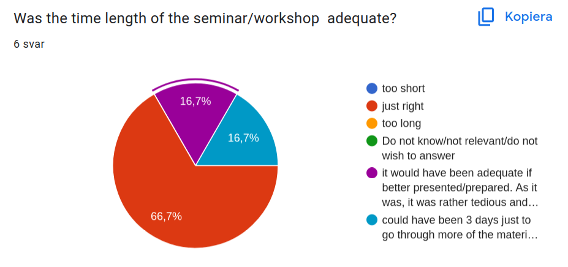
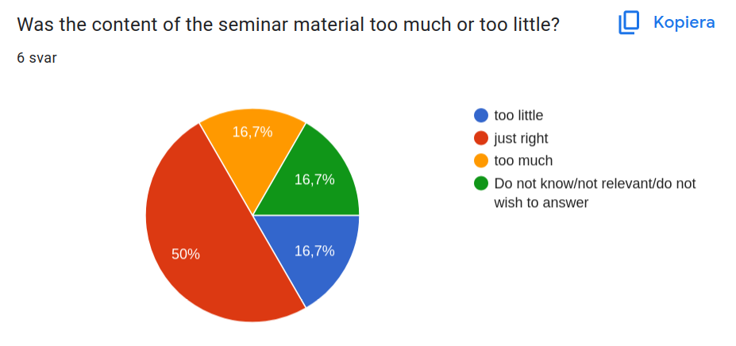
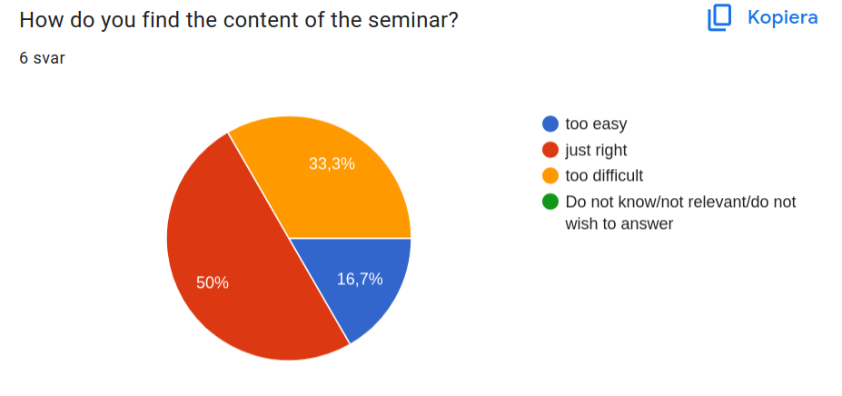
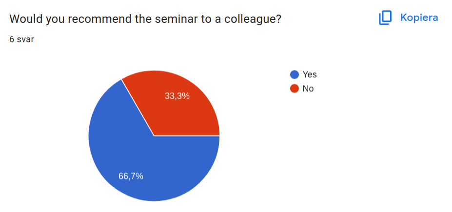
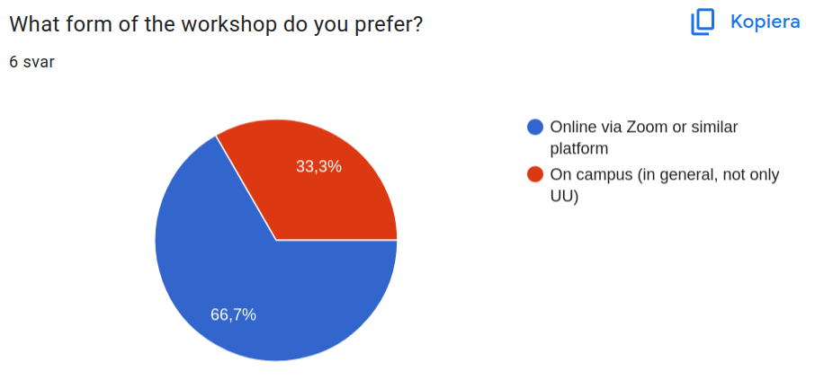
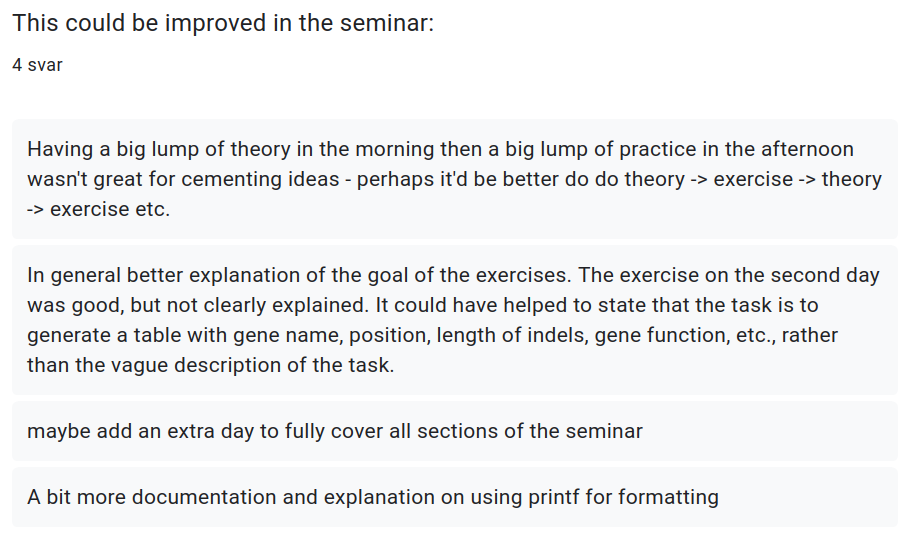
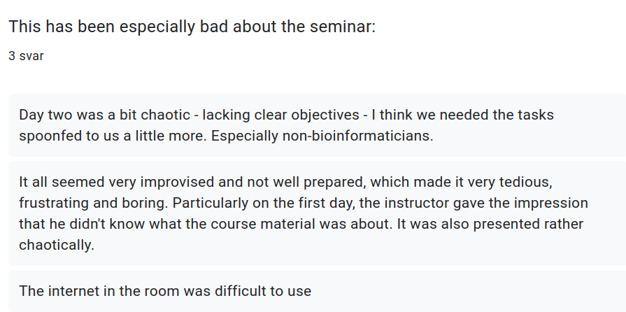
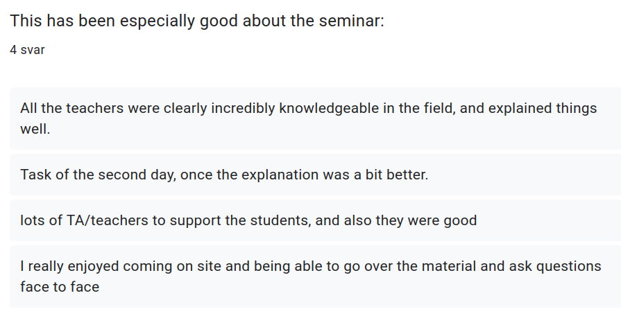

# Awk workshop 2024.08.{22,23} - evaluation

- Reflections: [Richel](../../reflections/20240822/README.md)

This is an evaluation of the Awk course taught in a different way,
yet with the same evaluation questions.
This is used to compare the two setups.

## How would you rate your overall satisfaction with the seminar?

- 1: 0x
- 2: 2x
- 3: 1x
- 4: 1x
- 5: 2x

## Was the time length of the seminar/workshop adequate?

- 0x too short
- 4x just right
- 0x too long
- 0x Do not know/not relevant/do notwish to answer
- 1x it would have been adequate if better presented/prepared.
  As it was, it was rather tedious and frustrating and thus too long
- 1x could have been 3 days just to go through more of the material,
  but I didn't feel like 2 days was necessarily too short

## Was the content of the seminar material too much or too little?

- 1x too little
- 3x just right
- 1x too much
- 1x Do not know/not relevant/do not wish to answer

## How do you find the content of the seminar?

- 1x too easy
- 3x just right
- 2x too difficult
- 0x Do not know/not relevant/do not wish to answer

## Would you recommend the seminar to a colleague?

- 2x no
- 4x yes

## What form of the workshop do you prefer?

- 4x Online via Zoom or similar platform
- 2x On campus (in general, not only UU)

## This could be improved in the seminar

- Having a big lump of theory in the morning
  then a big lump of practice in the afternoon wasn't great
  for cementing ideas - perhaps it'd be better do do
  theory -> exercise -> theory -> exercise etc.
- In general better explanation of the goal of the exercises.
  The exercise on the second day was good, but not clearly explained.
  It could have helped to state that the task is to generate a table with gene
  name, position, length of indels, gene function, etc.,
  rather than the vague description of the task.
- maybe add an extra day to fully cover all sections of the seminar
- A bit more documentation and explanation on using printf for formatting

## This has been especially bad about the seminar

- Day two was a bit chaotic - lacking clear objectives -
  I think we needed the tasks spoonfed to us a little more.
  Especially non-bioinformaticians.
- It all seemed very improvised and not well prepared,
  which made it very tedious, frustrating and boring.
  Particularly on the first day, the instructor gave the impression
  that he didn't know what the course material was about.
  It was also presented rather chaotically.
- The internet in the room was difficult to use

## This has been especially good about the seminar

- All the teachers were clearly incredibly knowledgeable in the field,
  and explained things well.
- Task of the second day, once the explanation was a bit better.
- lots of TA/teachers to support the students, and also they were good
- I really enjoyed coming on site and being able to go over the material
  and ask questions face to face
